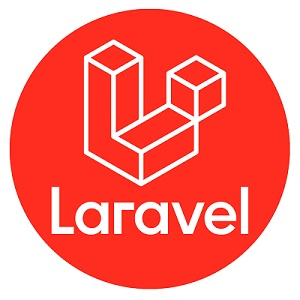
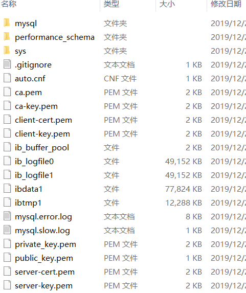

# Laravel+Vue开发前后端分离网站

——DNMP开发环境搭建（Docker + Nginx + MySQL5.7 + PHP7.2(预装了 composer) + Redis）

> laravel 官方推荐的使用[homestead](https://learnku.com/docs/laravel/6.x/homestead/5127)或[valet](https://learnku.com/docs/laravel/6.x/valet/5128)来搭建开发环境，我建议基于 docker 搭建开发环境更方便。
> 请加 `QQ:2922800186`，验证输入 laravel
>
> 本架构文件适用于**Windows、Linux、MacOs**

本教程[配套视频](https://www.bilibili.com/)

[**GitHub 地址**](https://github.com/youshengyouse/dnmp)      [**Gitee 地址**](https://gitee.com/advance/dnmp)

   


## 一.准备工作

1. 软件安装

   - `git`,[官网下载](https://git-scm.com/)，windows 用户建议在`git bash`下工作
   - `Docker` ，[windows 上安装](https://docs.docker.com/docker-for-windows/install/)，[Linux 之 Ubuntu 上安装](https://docs.docker.com/install/linux/docker-ce/ubuntu/)，[Linux 之 Centos 上安装](https://docs.docker.com/install/linux/docker-ce/centos/) ，MacOS 上安装](https://docs.docker.com/docker-for-mac/install/)(系统要求：Linux(支持 centos,debian,ubuntu,fedora 等)，Windows 10 Build 15063+，或 MacOS 10.12+，且必须要`64`位）
   - `docker-compose 1.7.0+`，[参考官网安装](https://docs.docker.com/compose/install/)

2. `clone`项目：

   ```shell
   $ git git@gitee.com:advance/dnmp.git
   ```

3. 如果不是`root`用户，还需将当前用户加入`docker`用户组：

   ```
   $ sudo gpasswd -a ${USER} docker
   ```

4. 拷贝并命名配置文件（为了统一，windows 用户请在 git bash 下工作），启动：

   ```shell
   $ cd dnmp
   $ docker-compose up -d s1 s2 s3 s4 s5
   # 根据需要启动指定服务，这5个服务第一次从镜像构建到容器运行约耗时9分钟
   # 默认安装了5个常用服务: nginx为s1, php为s2，mysql为s3, phpmyadmin为s4,redis为s5
   # .env，docker-compose.yml修改得up -d相应服务就行，如果Dockerfile有修改，请带参考--build
   # 如果只是服务的配置文件进行了修改，如nginx的nginx.conf修改了，请进入容器启动相应服务，如$ docker exec -it s1 nginx -s reload
   ```

5. 在物理理(宿主机)浏览器中访问：

   - http://localhost 或 https://localhost

   - http://127.0.0.1 或 https://127.0.0.1

   - http://192.168.0.104 或 https://192.168.0.104 (物理机的 ip，自已查看本机的 ip)

     PHP 代码在文件`./www/localhost/info.php`。

## 二： PHP

#### 2.1 安装扩展

PHP 的很多功能都是通过扩展实现，而安装扩展较费时间，默认除了 php 内置扩展外，只安装了`pdo_mysql`,`mysqli`,`mbstring`,`gd`,`curl`,`opcache`，想安装其它扩展，请修改.env 文件

```bash
PHP_EXTENSIONS=pdo_mysql,opcache,redis       # 扩展以英文逗号隔开
```

然后重新构建 php 镜像。

```bash
docker-compose build s2
```

#### 2.2 使用 composer 安装依赖

```bash
docker exec -it c2 sh
cd /www/localhost
composer update
```

## 三：mysql

mysql 数据库放在宿主机上的，没有在容器中，方便管理，第一次启动后，文件夹`dnmp\data\mysql5`的内容如下



## 四：Nginx

## 五：管理命令

#### 2.1 服务器启动和构建命令

如需管理服务，请在命令后面加上服务器名称，例如：

```bash
$ docker-compose up                         # 创建并且启动所有容器
$ docker-compose up -d                      # 创建并且后台运行方式启动所有容器
$ docker-compose up s1 s2 s3         # 创建并且启动nginx、php、mysql的多个容器
$ docker-compose up -d s1 s2 s3     # 创建并且已后台运行的方式启动nginx、php、mysql容器

$ docker-compose start s2                  # 启动服务
$ docker-compose stop s2                   # 停止服务
$ docker-compose restart s2                # 重启服务
$ docker-compose build s2                  # 构建或者重新构建服务

$ docker-compose rm s2                     # 删除并且停止php容器
$ docker-compose down                       # 停止并删除容器，网络，图像和挂载卷
```

#### 3.2 添加快捷命令

为了提高效率，对于使用频率较高的命令，写成别名的形式，打开`~/.bashrc`或者`~/.zshrc`文件，加上：

```bash
alias d1='docker exec -it c1 sh'
alias d2='docker exec -it c2 sh'   # 如果想进入php服务器，命令行输入 d2 就行
alias d3='docker exec -it c3 bash'
alias d5='docker exec -it c5 sh'
alias delc='docker rm -f `docker ps -aq`'       # 删除所有容器
alias deli='docker rmi -f `docker images -aq`'  # 删除所有镜像
alias dc12345='docker-compose up -d s1 s2 s3 s4 s5'  # 删除所有镜像
alias dc123='docker-compose up -d s1 s2 s3'  # 删除所有镜像
```

## 常见问题

### Docker 使用 cron 定时任务

[Docker 使用 cron 定时任务](https://www.awaimai.com/2615.html)

### Docker 容器时间

容器时间在.env 文件中配置`TZ`变量，所有支持的时区请看[时区列表·维基百科](https://en.wikipedia.org/wiki/List_of_tz_database_time_zones)或者[PHP 所支持的时区列表·PHP 官网](https://www.php.net/manual/zh/timezones.php)。

## 参考：

- https://github.com/jtreminio/php-docker
- https://github.com/cytopia/devilbox
- https://github.com/yeszao/dnmp
- https://github.com/guanguans/dnmp-plus
- https://github.com/shmilylbelva/dnmp
- https://github.com/Tinywan/dnmp

## License

MIT
